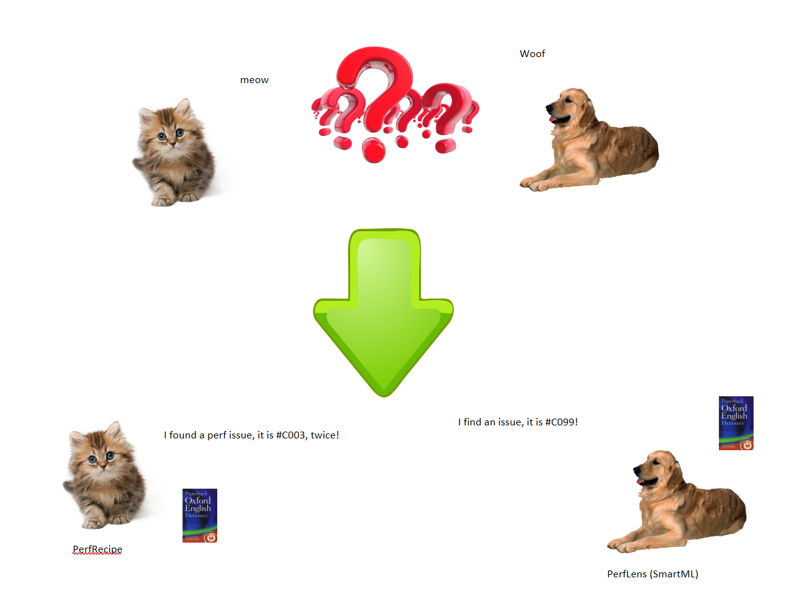

# Open Performance Issues [DRAFT]

This repository aims to be a comprehensive source of information on performance issues. The goal is to provide a single place for various performance analysis system to have a uniformed way to describe common performance problems and to provide their solutions.

Whether you're working on a web application, mobile app, or a system, performance is a crucial aspect to consider. The repository will include issues related to CPU usage, memory usage, network latency, and more. Each issue will be accompanied by a detailed explanation of what it is, why it's important, and possible improvements.

This is an open source repository and we welcome contributions from the community. If you have encountered a performance issue and have a solution, please consider submitting a pull request to add it to the repository. The more knowledge we share, the more we can improve the performance of our applications and systems.

# Performance issue language

# Benefits

* Consistent performance issue descriptions
  * Index the performance issues and provide consistent language to describe a performance issues in unified format.
    * See https://aka.ms/opiweb for all issues index.
  * The issue registries are versioned, so that you always know the set of issues by the specific version.
    * See [this json file](https://raw.githubusercontent.com/xiaomi7732/PerformanceIssueRepo/main/specs/registry/perf-issue.json) for the latest version of all the issues.
    * For the same file, see [version 1.0.0-alpha1](https://raw.githubusercontent.com/xiaomi7732/PerformanceIssueRepo/1.0.0-alpha1/specs/registry/perf-issue.json).
      * So that you could code against a given version, they are immutable.

* Shared help links to the tech documentations
  * Along with the issue, there's a doc link to the post addressing the issue.
  * When new post are written, you get it for free.

* Tool sets for querying/maintaining the issues.

* SDK support in the future that you will be able to access issues by code.

# Semantics

* Semantics that will be handled by the SDK

* Semantics that you will need to provide

# Actions

* Generate localization resources for known issues.
    * The issue registry will be published at <https://aka.ms/opi-registry>. It will be in form `perf-issue.version.json`.
        * For example: perf-issue.20230201.json.

